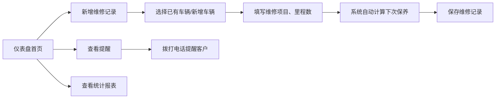

## 1. 产品概述

小型汽修店车辆维修管理系统，用于记录车辆维修信息、自动计算保养提醒、管理车辆档案，并提供月度统计分析。帮助汽修店高效管理客户车辆，减少漏记和遗忘，提升服务质量。

## 2. 核心功能

### 2.1 用户角色
| 角色 | 注册方式 | 核心权限 |
|------|----------|----------|
| 店家管理员 | 默认内置 | 全部功能：车辆管理、维修记录、保养提醒、统计报表、保险管理 |

### 2.2 功能模块
1. **仪表盘首页**：待办提醒（保养到期、保险到期）、今日概览、快速操作入口
2. **车辆管理**：车辆档案列表、新增/编辑车辆、记录机油型号和轮胎型号
3. **维修记录**：维修工单列表、新增维修记录（车牌、车主电话、里程数、维修项目）
4. **保养与保险提醒**：待保养车辆列表、保险到期提醒、一键拨号
5. **统计报表**：月度故障类型统计、师傅修车效率排名

### 2.3 页面详情
| 页面名称 | 模块名称 | 功能描述 |
|----------|----------|----------|
| 仪表盘首页 | 提醒卡片 | 显示即将到期的保养和保险提醒，支持标记已处理 |
| 仪表盘首页 | 数据概览 | 显示在修车辆数、本月维修数、待提醒客户数 |
| 仪表盘首页 | 快捷操作 | 快速新增维修记录、快速添加车辆 |
| 车辆管理 | 车辆列表 | 表格展示所有车辆，支持按车牌搜索 |
| 车辆管理 | 车辆表单 | 新增/编辑车辆信息：车牌、车主姓名、电话、车型、机油型号、轮胎型号 |
| 维修记录 | 记录列表 | 表格展示所有维修记录，支持按车牌、日期筛选 |
| 维修记录 | 记录表单 | 新增维修记录：选择车辆、里程数、维修项目（多选）、维修师傅、费用、备注 |
| 保养与保险提醒 | 保养提醒 | 根据上次保养里程自动计算下次保养里程（默认+5000公里），显示剩余里程/已超期 |
| 保养与保险提醒 | 保险提醒 | 显示保险到期日期，提前30天提醒 |
| 统计报表 | 故障统计 | 按月份统计各故障类型出现次数，柱状图展示 |
| 统计报表 | 师傅效率 | 按月份统计每位师傅的维修单量和平均耗时，排名展示 |

## 3. 核心流程

用户打开系统 → 仪表盘查看今日待办和提醒 → 点击新增维修记录 → 选择/添加车辆 → 填写维修项目和里程 → 系统自动计算下次保养时间 → 保存记录 → 月底查看统计报表

## 4. 用户界面设计

### 4.1 设计风格
- **主色调**：工业深蓝 (#1e3a5f)，搭配警示橙 (#f97316) 作为提醒强调色
- **辅助色**：成功绿 (#10b981)、警告黄 (#f59e0b)、危险红 (#ef4444)
- **按钮风格**：圆角 8px，悬停时有阴影和颜色加深效果
- **字体**：标题使用系统字体加粗，正文使用清晰易读的无衬线字体
- **布局风格**：左侧固定导航栏 + 右侧内容区，卡片式布局，信息分区明确
- **图标风格**：使用 lucide-react 线性图标，简洁统一

### 4.2 页面设计概览
| 页面名称 | 模块名称 | UI 元素 |
|----------|----------|---------|
| 仪表盘首页 | 提醒卡片 | 橙/红色警示卡片，显示车辆车牌、剩余里程/天数、拨号按钮 |
| 仪表盘首页 | 数据概览 | 四个统计卡片，带有图标和趋势指示 |
| 车辆管理 | 车辆列表 | 数据表格，每行显示车辆关键信息，操作按钮 |
| 维修记录 | 记录表单 | 分组表单，车辆信息区、维修项目区、师傅与费用区 |
| 统计报表 | 图表区 | 响应式柱状图和排名列表 |

### 4.3 响应式
桌面端优先设计，内容区最小宽度 1024px。在平板设备上自动调整卡片布局，移动端折叠导航栏为汉堡菜单。
