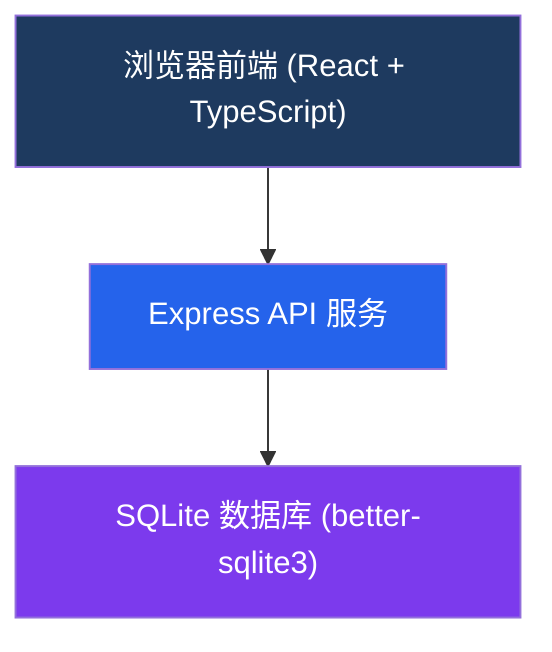
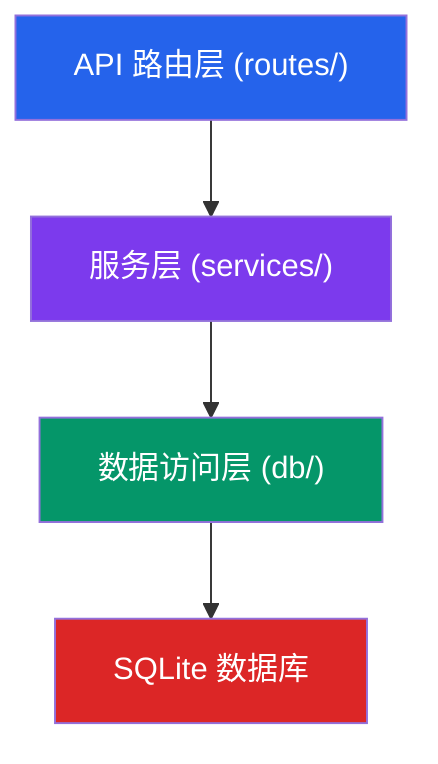
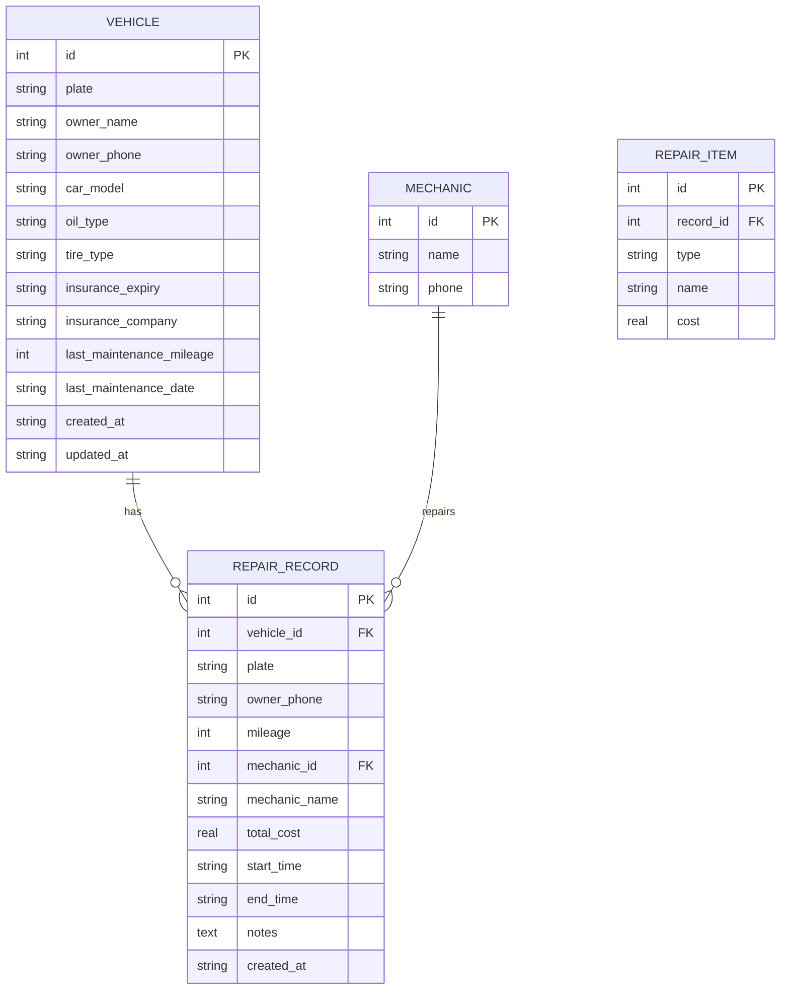

## 1. 架构设计



## 2. 技术说明

- **前端**：React@18 + TypeScript + Vite + TailwindCSS@3 + Zustand（状态管理）+ React Router@6 + lucide-react（图标）+ recharts（图表）
- **初始化工具**：vite-init react-express-ts 模板
- **后端**：Express@4 + TypeScript + better-sqlite3（同步 SQLite 驱动）
- **数据库**：SQLite（文件存储，无需额外服务，适合小型店铺）
- **数据持久化**：数据文件存储在项目根目录 `data/` 文件夹下

## 3. 路由定义

| 路由 | 用途 |
|------|------|
| / | 仪表盘首页（提醒、数据概览、快捷操作） |
| /vehicles | 车辆管理列表 |
| /vehicles/new | 新增车辆 |
| /vehicles/:id/edit | 编辑车辆 |
| /records | 维修记录列表 |
| /records/new | 新增维修记录 |
| /records/:id | 维修记录详情 |
| /reminders | 保养与保险提醒 |
| /statistics | 统计报表 |

### 后端 API 路由
| 方法 | 路径 | 用途 |
|------|------|------|
| GET | /api/vehicles | 获取车辆列表 |
| GET | /api/vehicles/:id | 获取车辆详情 |
| POST | /api/vehicles | 新增车辆 |
| PUT | /api/vehicles/:id | 更新车辆 |
| DELETE | /api/vehicles/:id | 删除车辆 |
| GET | /api/records | 获取维修记录列表 |
| GET | /api/records/:id | 获取维修记录详情 |
| POST | /api/records | 新增维修记录 |
| GET | /api/reminders/maintenance | 获取保养提醒列表 |
| GET | /api/reminders/insurance | 获取保险提醒列表 |
| GET | /api/statistics/faults | 获取故障类型统计 |
| GET | /api/statistics/mechanics | 获取师傅效率统计 |

## 4. API 定义（TypeScript 类型）

```typescript
// 车辆
interface Vehicle {
  id: number;
  plate: string;           // 车牌号
  ownerName: string;       // 车主姓名
  ownerPhone: string;      // 车主电话
  carModel: string;        // 车型
  oilType: string;         // 机油型号
  tireType: string;        // 轮胎型号
  insuranceExpiry: string; // 保险到期日期 YYYY-MM-DD
  insuranceCompany: string;// 保险公司
  lastMaintenanceMileage: number; // 上次保养里程
  lastMaintenanceDate: string;    // 上次保养日期
  createdAt: string;
  updatedAt: string;
}

// 维修记录
interface RepairRecord {
  id: number;
  vehicleId: number;
  plate: string;
  ownerPhone: string;
  mileage: number;         // 本次维修里程
  repairItems: RepairItem[]; // 维修项目
  mechanicId: number;      // 维修师傅ID
  mechanicName: string;    // 维修师傅姓名
  totalCost: number;       // 总费用
  startTime: string;       // 开始时间
  endTime: string;         // 结束时间
  notes: string;           // 备注
  createdAt: string;
}

// 维修项目
interface RepairItem {
  type: 'oil' | 'brake' | 'ac' | 'tire' | 'engine' | 'other';
  name: string;            // 项目名称
  cost: number;            // 项目费用
}

// 师傅
interface Mechanic {
  id: number;
  name: string;
  phone: string;
}
```

## 5. 服务端架构图



## 6. 数据模型

### 6.1 数据模型定义



### 6.2 数据定义语言（SQLite）

```sql
CREATE TABLE IF NOT EXISTS vehicles (
  id INTEGER PRIMARY KEY AUTOINCREMENT,
  plate TEXT NOT NULL UNIQUE,
  owner_name TEXT NOT NULL,
  owner_phone TEXT NOT NULL,
  car_model TEXT,
  oil_type TEXT,
  tire_type TEXT,
  insurance_expiry TEXT,
  insurance_company TEXT,
  last_maintenance_mileage INTEGER DEFAULT 0,
  last_maintenance_date TEXT,
  created_at TEXT NOT NULL DEFAULT (datetime('now')),
  updated_at TEXT NOT NULL DEFAULT (datetime('now'))
);

CREATE TABLE IF NOT EXISTS mechanics (
  id INTEGER PRIMARY KEY AUTOINCREMENT,
  name TEXT NOT NULL,
  phone TEXT
);

CREATE TABLE IF NOT EXISTS repair_records (
  id INTEGER PRIMARY KEY AUTOINCREMENT,
  vehicle_id INTEGER NOT NULL,
  plate TEXT NOT NULL,
  owner_phone TEXT NOT NULL,
  mileage INTEGER NOT NULL,
  mechanic_id INTEGER,
  mechanic_name TEXT,
  total_cost REAL NOT NULL DEFAULT 0,
  start_time TEXT NOT NULL,
  end_time TEXT,
  notes TEXT,
  created_at TEXT NOT NULL DEFAULT (datetime('now')),
  FOREIGN KEY (vehicle_id) REFERENCES vehicles(id),
  FOREIGN KEY (mechanic_id) REFERENCES mechanics(id)
);

CREATE TABLE IF NOT EXISTS repair_items (
  id INTEGER PRIMARY KEY AUTOINCREMENT,
  record_id INTEGER NOT NULL,
  type TEXT NOT NULL,
  name TEXT NOT NULL,
  cost REAL NOT NULL DEFAULT 0,
  FOREIGN KEY (record_id) REFERENCES repair_records(id) ON DELETE CASCADE
);

CREATE INDEX IF NOT EXISTS idx_vehicles_plate ON vehicles(plate);
CREATE INDEX IF NOT EXISTS idx_records_vehicle ON repair_records(vehicle_id);
CREATE INDEX IF NOT EXISTS idx_records_created ON repair_records(created_at);
```
